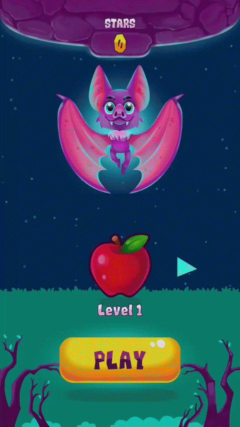
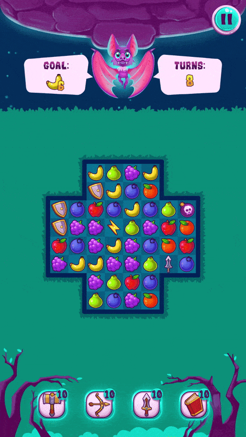

# Match-3 MVP

 Mobile Match-3 game built with Model-View-Presenter (MVP) architecture using Unity.

   

#### Main features:
- **MVP Architecture**: Clear separation of game logic and presentation layers (Model, View, and Presenter);
- **High Test Coverage**: Ensures stability and quality of the game mechanics;
- **Configurable Levels**: Easily modifiable level designs and block configurations;
- **Activatable Block Types**: Blocks with different behaviors and unique activations (e.g., explosive, targeted).
- **Consumable Bonuses**: Special bonuses with distinct effects that enhance gameplay;


## Installation

#### Requirements:

- Unity 2021.3+
- ZenJect
- UniTask
- Input System
- TextMeshPro

#### Install manually:

1. Clone this repository:
	```
	git clone https://github.com/WiLLLLL683/Match-3-MVC-Project.git
	```
2. Open the project in Unity.
3. Load the Boot scene.
4. Press Play to start the game.


## How to play

1. Download the [Match-3_MVP.apk](https://github.com/WiLLLLL683/Match-3-MVC-Project/releases/latest/download/Match-3_MVP.apk) file from last release.
2. Install APK to your Android device.
3. Launch the game and enjoy!
